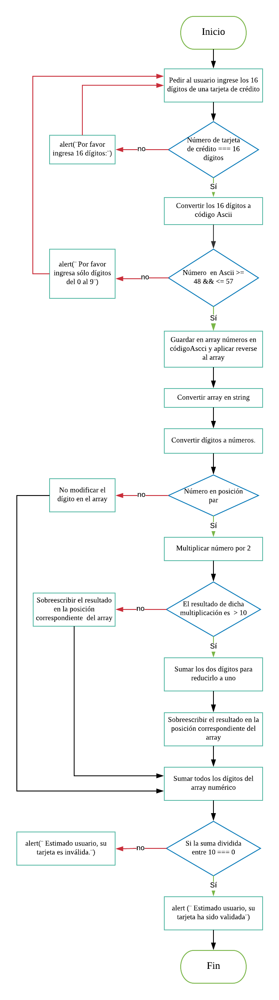

# Tarjeta de Crédito Válida
#### *Confirmando la validez de una tarjeta de crédito según el algoritmo de Luhn.*


Crea una web que pida, por medio de un *prompt*, el número de una tarjeta de crédito y confirme su validez según el  *algoritmo de Luhn*.


#### Input:
```javascript
[
  "4152313312405330"
]
```
#### Output:
```javascript
[
  "Estimado usuario, su tarjeta ha sido validada"
]
```

#### Consideraciones Específicas:
- El código está compuesto por la función **_isValidCard_**.
- El usuario no puede ingresar un campo vacío.


#### Pseudocódigo:

- Obtener del usuario el número de una tarjeta de crédito.
- Validar que el usuario no ingrese un campo vacío.
- Confirmar la validez o invalidez de la tarjeta de crédito.
- Imprimir que la tarjeta es válida, o inválida en su defecto.

#### Diagrama de Flujo:

